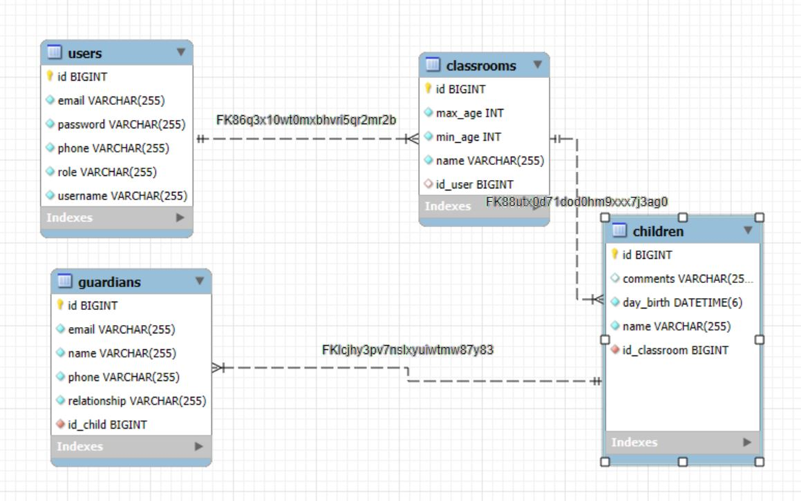

# Aplicación de Gestión del Centro Infantil Arco Iris

## Descripción del Proyecto
La **Aplicación de Gestión del Centro Infantil Arco Iris** es una API desarrollada en **Java con Spring Boot**. Está diseñada para optimizar la gestión de una guardería, permitiendo a los usuarios realizar tareas relacionadas con niños, aulas y profesores. La aplicación incluye funciones de autenticación y control de acceso para diferentes roles.

---

## Objetivos
- Facilitar la gestión de niños, aulas y profesores en una guardería.
- Ofrecer un sistema de roles con permisos diferenciados para la **directora** y los **profesores**.
- Implementar operaciones CRUD para todos los registros relacionados.

---

## Características Principales

### Roles de Usuario
- **Directora (Administradora):**
  - Gestión completa de profesores, aulas y niños (Crear, Leer, Actualizar, Eliminar).
  - Asignación de profesores a aulas.
  - Asignación de niños a aulas.
  
- **Profesores:**
  - Acceso a la lista de niños de su aula asignada.

### Aulas
- Aulas definidas por niveles de edad:
  - **Pollitos (0 a 12 meses)**
  - **Patitos (13 a 24 meses)**
  - **Ardillas (25 a 36 meses)**
- Cada aula tiene un profesor asignado.

### Operaciones CRUD
- Gestión de:
  - Niños.
  - Profesores.
  - Aulas.
 
---

## Tecnologías Utilizadas
- **Backend**: Java con Spring Boot.
- **Base de Datos**: MySQL.

---
## UML

## Entidad - Relación

## Plan de Desarrollo

### Fase 1: Planificación
- Definir requisitos del proyecto.
- Crear diagramas UML.
- Modelar la base de datos en MySQL.

### Fase 2: Desarrollo
- Configurar el entorno de desarrollo con Java y Spring Boot.
- Implementar los servicios del backend.
- Crear las tablas necesarias en MySQL.

### Fase 3: Pruebas
- Realizar pruebas unitarias con **JUnit 5** y **Mockito**.

---

## Instalación y Ejecución

### Prerrequisitos

1. Tener instalado:
   - **Java JDK 17+**
   - **Spring Boot**.
   - **MySQL**.
   - **Maven**.

2. Configurar una base de datos MySQL:
   - Crear un esquema llamado `ciarcoiris`.
   - Actualizar las credenciales de acceso en `application.properties`.

3. Clonar el repositorio:

    git clone [https://github.com/Susana-Artime/CIArcoIris](https://github.com/Susana-Artime/CIArcoIris)

   
4. Compilar y Ejecutar el Proyecto:

   Ejecuta el siguiente comando para compilar:
   
   mvn clean install

   Luego,lanza la aplicación

   mvn spring-boot:run

## Estructura del Proyecto

**users/:** Contiene el flujo y las operaciones de los usuarios.

**classrooms/:** Contiene el flujo y las operaciones de las aulas.

**childs/:** Contiene el flujo y las operaciones de los niños.

**guardians/:** Contiene el flujo y las operaciones de los tutores legales de los niños. (En desarrollo)

